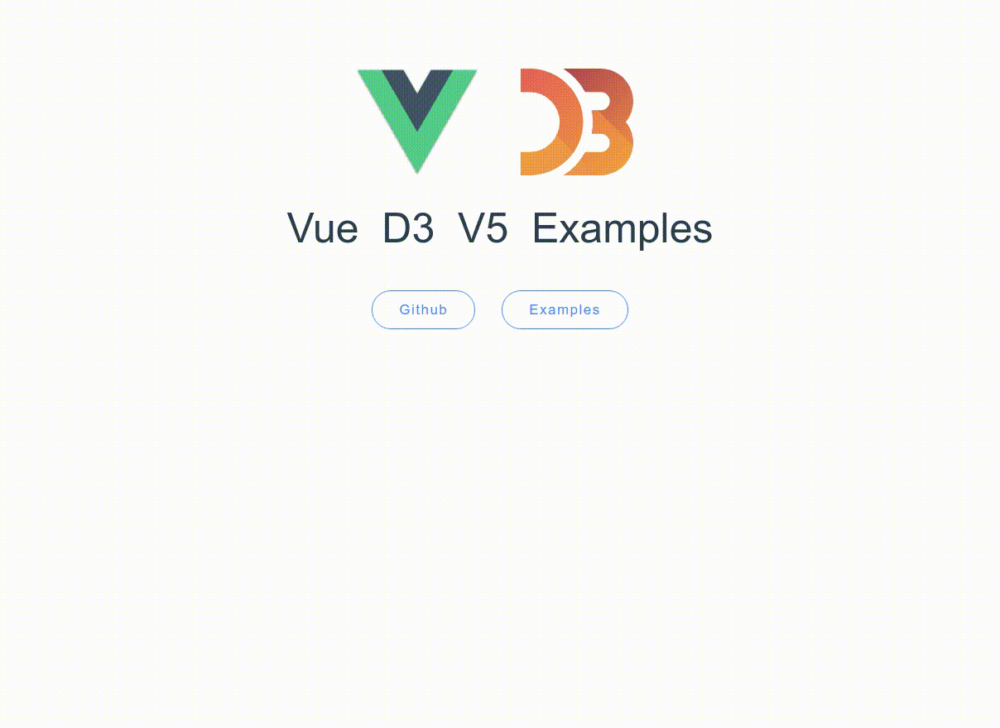

# Vue D3 V5 Examples

`Vue`   `D3`   `V5`   `Examples`

npm: `v6.7.0`

node: `v11.10.0`

d3: `v5.9.1`

### Preview



### Project setup
```
npm install
```

### npm run lint & npm run serve
```
npm run dev
```

### Compiles and hot-reloads for development
```
npm run serve
```

### Compiles and minifies for production (Support only deploy to GitHub)
```
npm run build
```

### Code for lint check
```
npm run lint
```

### Customize configuration

See [Configuration Reference](https://cli.vuejs.org/config/).
